# MitiConnect

Date: 05/06/2026
État: Not started

Eva PEREZ LOPEZ

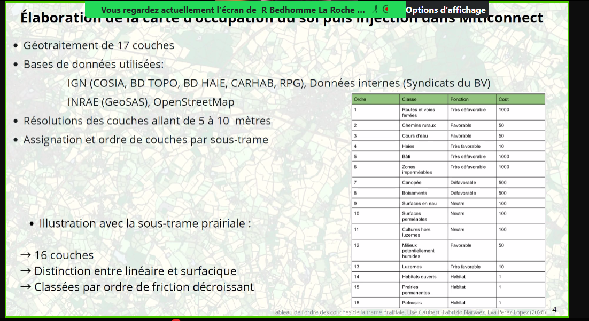

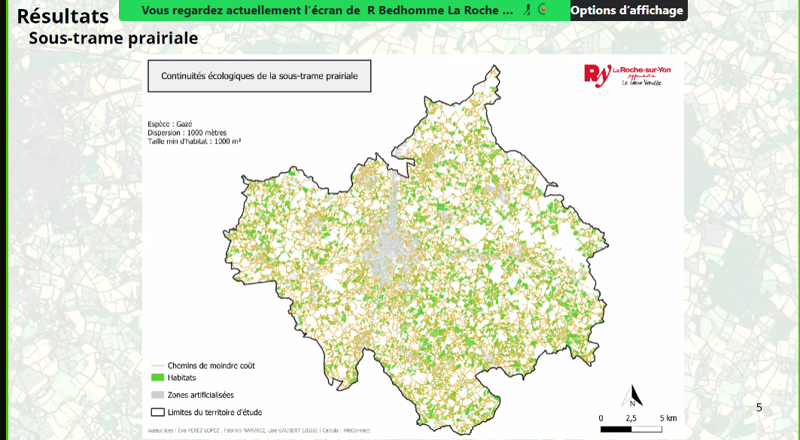

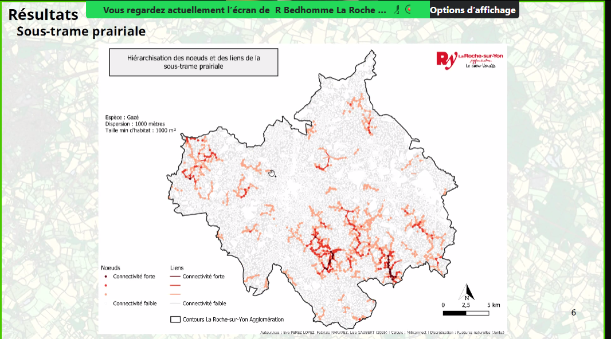

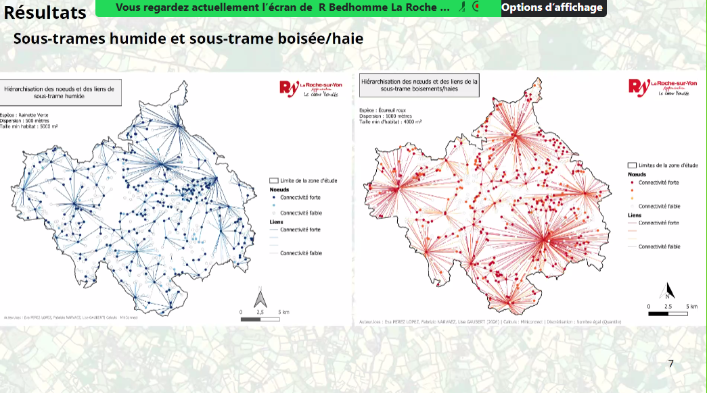

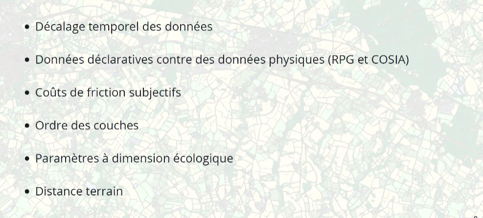

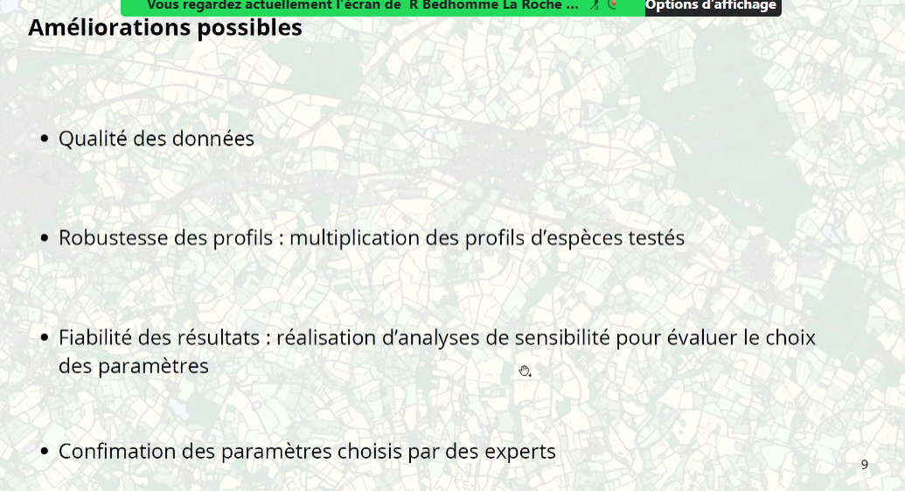

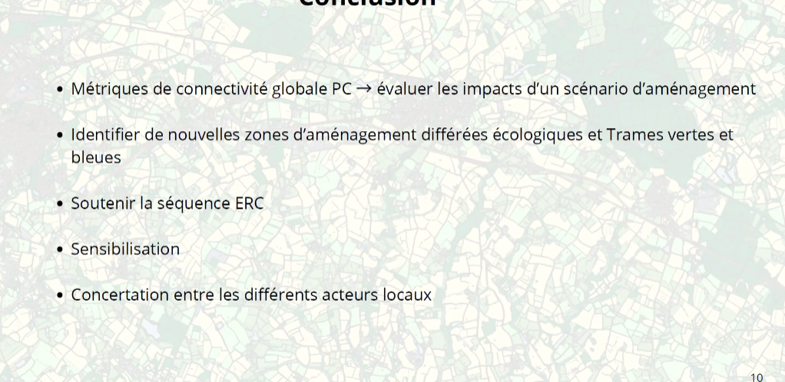

Concernant le critère "habitat", il s'agit de la superficie des "domaines vitaux" c'est bien ça ?

ruptures naturelles de jenks pour les indices, pour la discrétisation des sous-trames, 4 classes

ordre des couches

Il est possible de plaquer les ouvrages faune ou mixte sur les infras pour ajouter des points/zones de perméabilité (si les données sont connues)
Pour info : [https://passagesfaune.fr/](https://passagesfaune.fr/) (pas complet mais de mieux en mieux)

+ [https://www.data.gouv.fr/datasets/obstacles-a-lecoulement](https://www.data.gouv.fr/datasets/obstacles-a-lecoulement) en recherchant des infos sur la perméabilité/transparence pour la faune terrestre (ex. : présence de banquettes)

**Céline MATHIEU (Biotope)**14:38

quels indicateurs privilégiez-vous pour la hiérarchisation des RB et continuités ?

**Simon Tarabon**14:51

Plusieurs métriques locales existent : IF, F, BC,… Et montrent des choses différentes en lien avec des flux biologiques, leur centralité dans les réseaux, etc. Ils sont aussi complémentaires donc peuvent être utilisés ensemble

**Pascal Guichard - TAUW France - Ecologue**14:52

Ce qui complexe pour les chiroptères c'est que les différentes espèces ont des "domaines vitaux" et des distances de "dispersion" souvent importantes et très variables, et des habitats préférentiels divers, avec aussi une dépendance aux structures spatiales très diverses (certaines espèces y étant étroitement liées, alors que d'autres beaucoup moins). Difficile donc sur le fond et la forme de considérer dans l'ensemble le groupe des chiroptères pour en sortir une modélisation.
Peut-être plus travailler sur des "guildes".

Vous avez évoqué à plusieurs reprises des essai erreurs pour représenter la réalité du terrain. Avez-vous confronté vos modélisations à des données de présence absence des espèces pour ajuster les paramètres du modèle ?

Peu de BD sur les "traits de vie" des espèces malheureusement pour beaucoup de groupes taxonomiques. Cette publictaion a fait état des traits de vie de 39 espèces : [https://www.trameverteetbleue.fr/documentation/references-bibliographiques/syntheses-bibliographiques-sur-traits-vie-39-especes](https://www.trameverteetbleue.fr/documentation/references-bibliographiques/syntheses-bibliographiques-sur-traits-vie-39-especes)

Concernant les analyses de sensibilité et les coûts de friction, si j'ai bien compris, il n'existe donc pas de données de référence par espèce ou cortège, on risque donc un biais lié à subjectivité selon l'utilisateur ?

effet de bord

/// 

solene nitsche

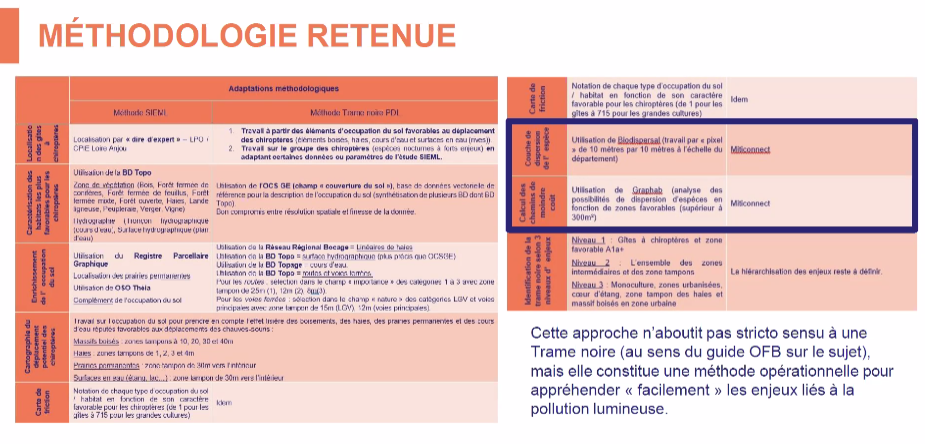

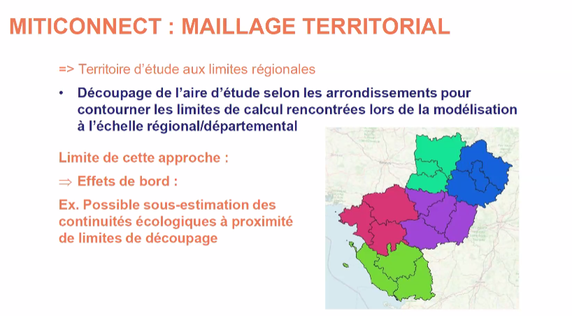

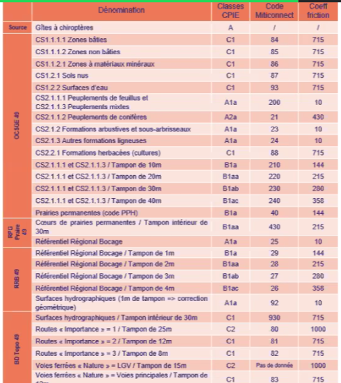

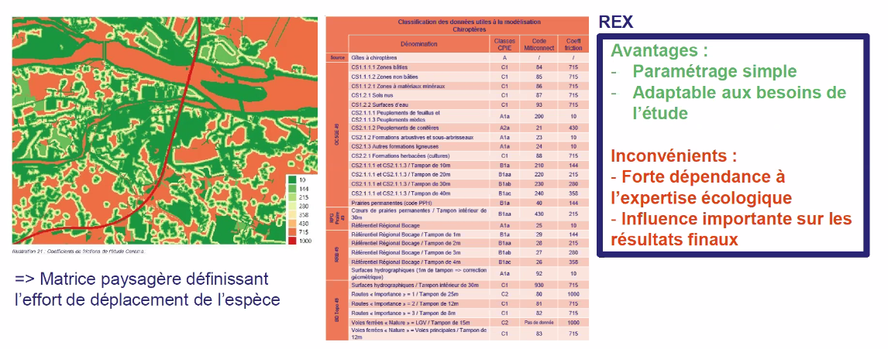

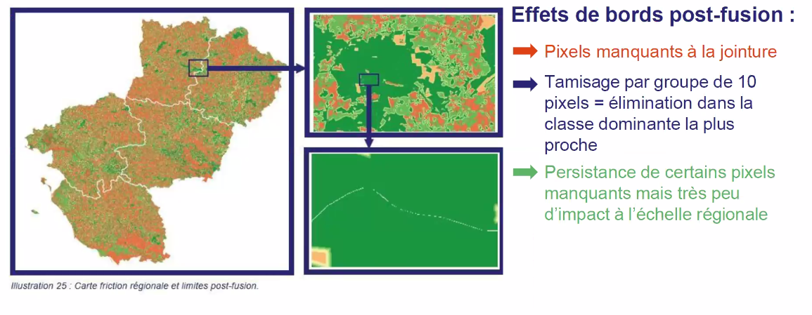

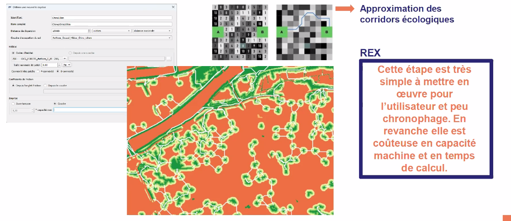

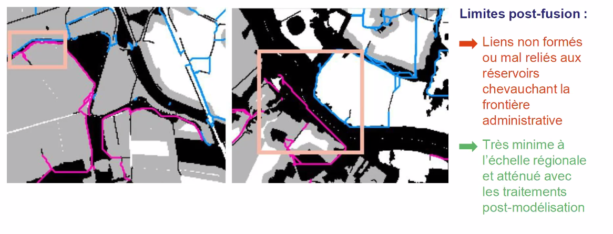

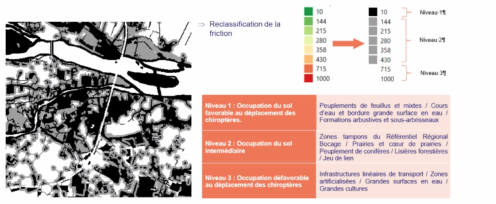

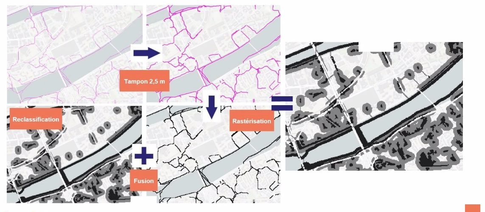

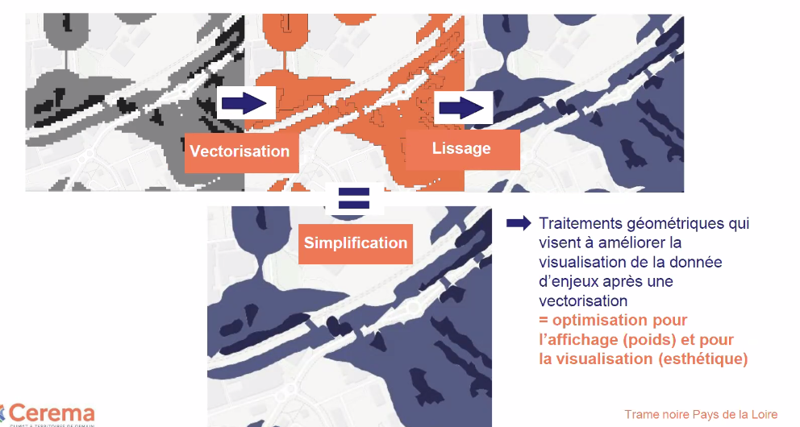

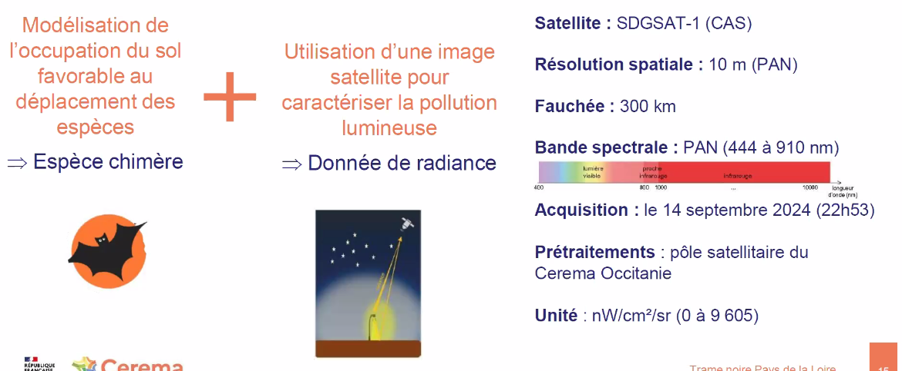

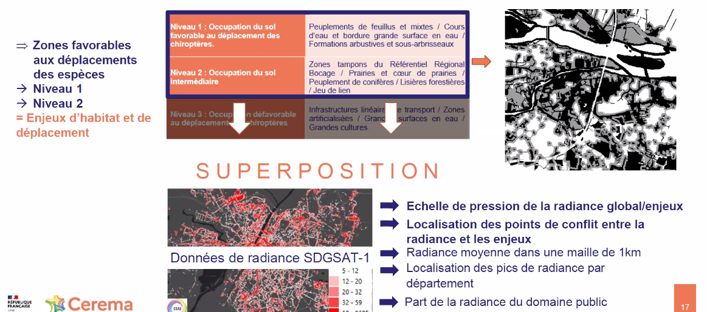

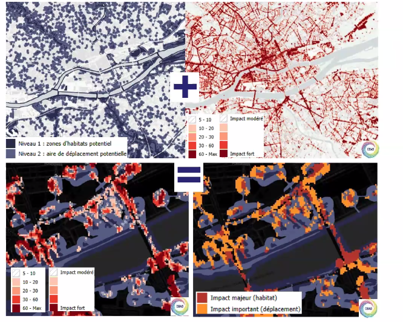

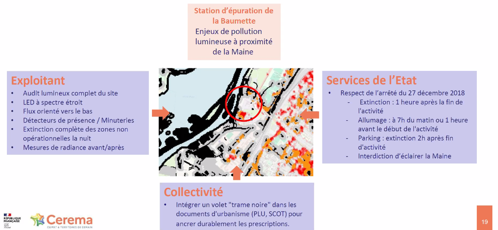

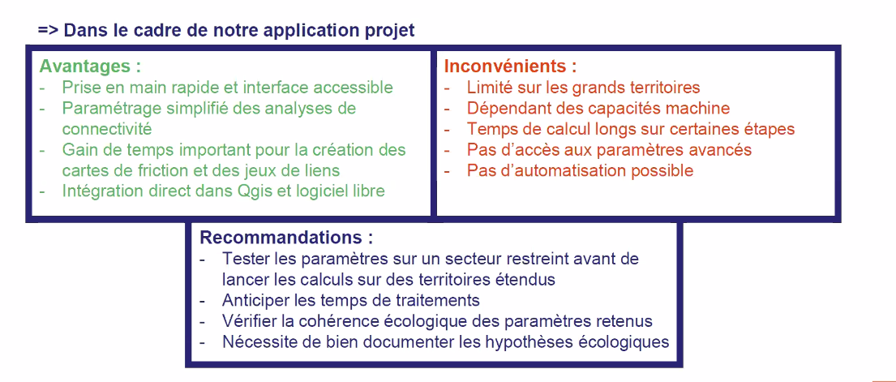