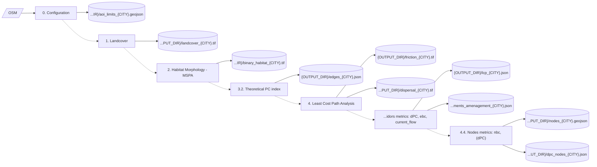
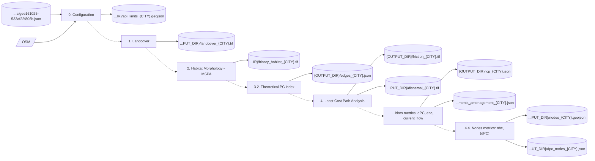
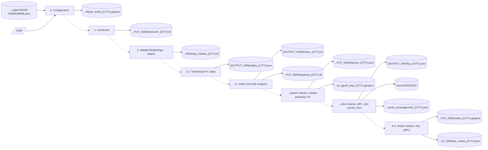

# notebooks_overview.md: project corridor_project

> Generated on 2026-06-09 14:50 by `refresh_notebook_overview.py`. One Mermaid
> flow diagram per notebook, intermediate level: sources / files in,
> main steps, files out. Mechanical I/O detection; file names held in a
> variable appear by type (CSV, GeoTIFF).
> To be enriched via the AI prompt `prompts/notebook_overview.md`.

Legend: `[(file)]` = local file, `[/source/]` = external source,
`[step]` = notebook section, `-.->` = sequential chaining.

## `kourou_prod.ipynb`

**Ville de Kourou**  
_Summary: [to be completed by the AI]_

## `lrsy_prod.ipynb`

**La Roche-sur-Yon Agglomération**  
_Summary: [to be completed by the AI]_

## `my_custom_libs/overturemaps/examples/geopandas_example.ipynb`

**geopandas_example**  
_Summary: [to be completed by the AI]_

## `nancy_prod.ipynb`

**Métropole du Grand Nancy**  
_Summary: [to be completed by the AI]_

## `perpignan_prod.ipynb`

**Ville de Perpignan**  
_Summary: [to be completed by the AI]_

## `tlse_prod.ipynb`

**Toulouse Métropole**  
_Summary: [to be completed by the AI]_

